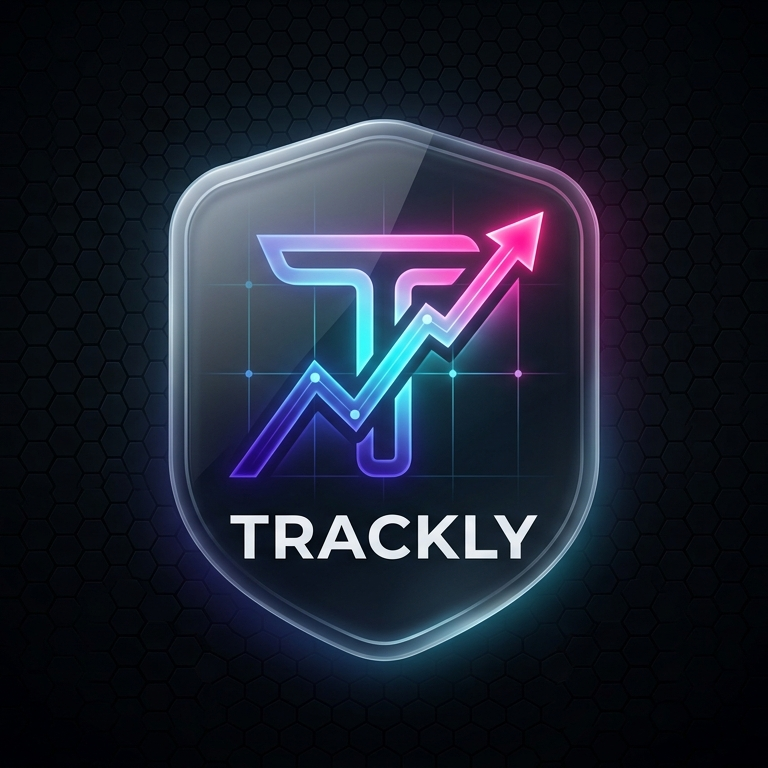
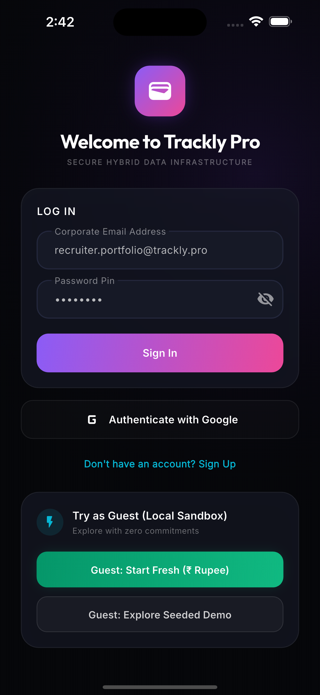
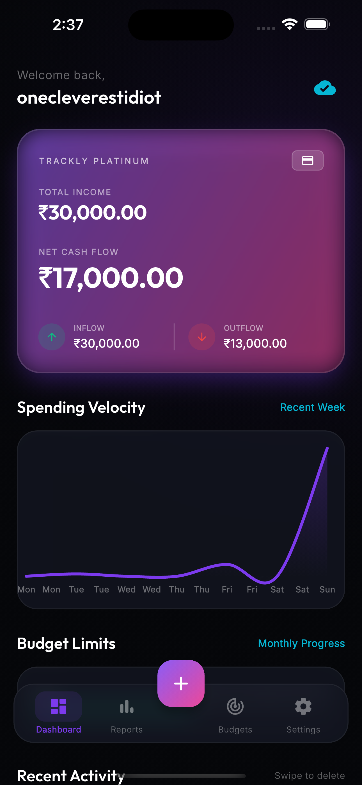
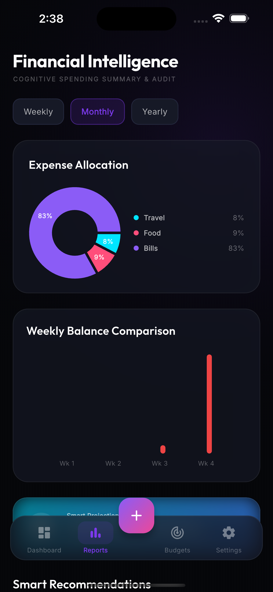
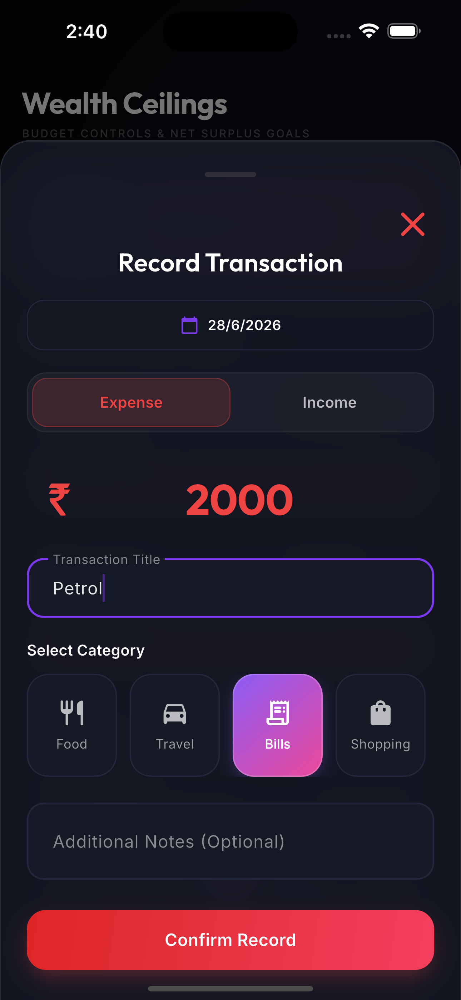
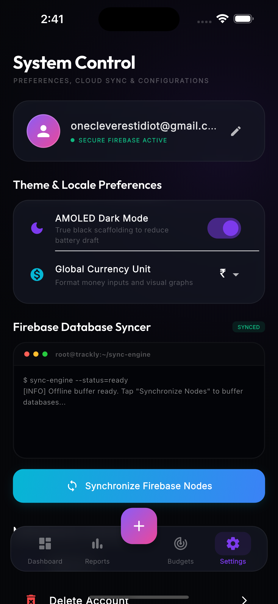
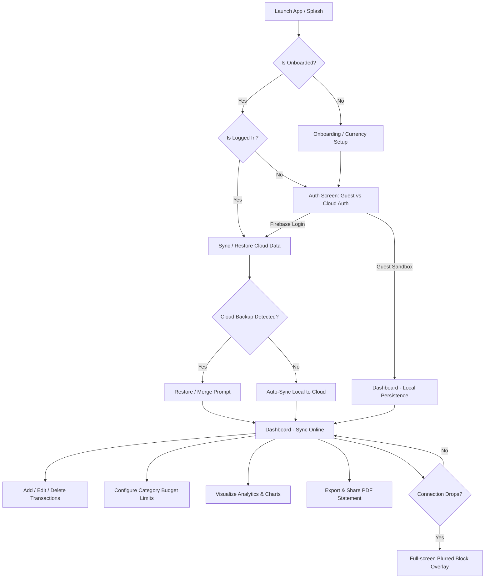

# 📱 Trackly Pro — Premium Fintech Ledger & Wealth Tracker

Trackly Pro is a high-fidelity, premium personal finance and wealth-tracking mobile application built with **Flutter**, **Riverpod**, and **Firebase**. Designed with modern fintech design principles (glassmorphism, vibrant neon gradients, and a true AMOLED dark theme), it offers a seamless experience for managing transactions, controlling budgets, and exporting financial statements.

---

## 🎨 Visual Identity & Screenshots

<p align="center">
  
</p>

### App Screens Showcase
> **Tip:** Save your screenshots in the `screenshots/` directory with the names below to automatically show them in your GitHub repository!

| 🔒 Auth Page | 💳 Dashboard | 📊 Reports |
| :---: | :---: | :---: |
|  |  |  |
| **Secure Login / Restore** | **Fintech Card & Ledger** | **Category Charts & PDF Export** |

| 🛡️ Budget | ⚙️ Settings | ➕ Add Transaction |
| :---: | :---: | :---: |
|  |  |  |
| **Monthly Cap Limits** | **Theme & Profile Sync** | **Record Income / Expense** |

---

## 🚀 Key Features

* **🎨 Ultra-Premium Fintech UI:** Rich visual elements, glassmorphic card layouts, responsive charts, and custom transitions tailored for high-end portfolio presentations.
* **🔒 Dual-Mode Authentication (Firebase & Guest):** Use the secure online mode synced to Cloud Firestore, or access a fully functional local guest mode backed by persistent cached device storage.
* **🔄 Seamless Background Sync:** Auto-syncs transactions, budgets, and profile states when online. Recognizes pre-existing Cloud Backups on new device login and prompts to **Restore**, **Merge**, or **Start Fresh**.
* **📊 Spending Analytics & Limit Monitoring:** Dynamic weekly velocity lines, category expenditure pie charts, and monthly progress bars with automated visual warning indicators.
* **📄 Custom Unicode PDF Engine:** Generates highly structured, vectorized transaction statements containing dynamic currency glyphs (such as `₹`, `$`, `€`) and invokes native sharing options.
* **🌐 Real-time Connection Protection:** Implements an active network listener that freezes user interactions with a beautiful blurred overlay if internet connectivity is lost during cloud sync, preventing data corruption.

---

## 🧭 Application Architecture & Workflow



---

## 🛠️ Technical Stack

* **Core Framework:** [Flutter (Dart SDK)](https://flutter.dev)
* **State Management:** [Riverpod 3.0 (Notifier Providers)](https://riverpod.dev)
* **Backend Database:** [Firebase Auth & Cloud Firestore](https://firebase.google.com)
* **UI/Visual Charts:** [fl_chart](https://pub.dev/packages/fl_chart)
* **PDF Exporter:** [pdf](https://pub.dev/packages/pdf) & [printing](https://pub.dev/packages/printing) (Roboto Google Font Integration)
* **Network Monitor:** [connectivity_plus](https://pub.dev/packages/connectivity_plus)
* **Icon Compiler:** [flutter_launcher_icons](https://pub.dev/packages/flutter_launcher_icons)

---

## 💻 Setup & Installation Guide

### Prerequisites
* Flutter SDK (3.22+ recommended)
* Xcode (for iOS testing - macOS only)
* Android Studio / SDK (for Android testing)
* A Firebase Project configured with Authentication and Cloud Firestore.

### 1. Clone the repository
```bash
git clone https://github.com/<your-username>/Trackly.git
cd Trackly/trackly
```

### 2. Configure Firebase Configurations
Add your platform configurations downloaded from the Firebase Console:
* **Android:** Place `google-services.json` inside android/app/ directory.
* **iOS:** Place `GoogleService-Info.plist` inside ios/Runner/ directory via Xcode.

### 3. Install packages & Generate app icons
```bash
# Get dependencies
flutter pub get

# Generate app icons for iOS & Android
flutter pub run flutter_launcher_icons
```

### 4. Build and Run
```bash
# Verify analysis has no compile errors
flutter analyze

# Run on your simulator/connected device
flutter run
```

---

## 📄 License
This project is licensed under the MIT License - see the LICENSE file for details.
 